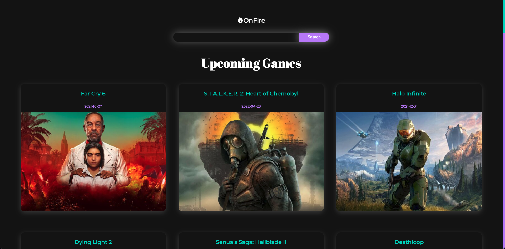
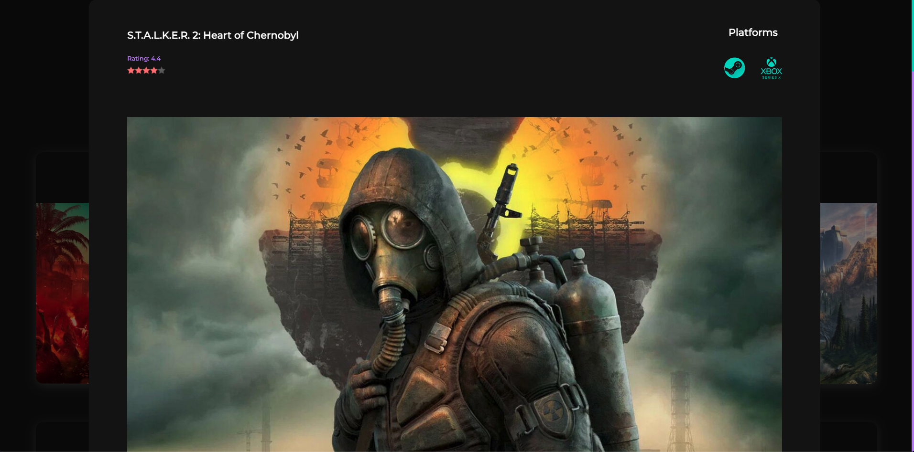

# OnFire

**THIS IS A NON-COMMERCIAL-PROJECT DONE WITH REACT, REDUX & AXIOS**

OnFire is a simple web application and search engine for games, which shows the upcoming, newest & the most popular games for all platforms.
You can also search for your favourite ones.

Current version: 1.0 || 14.08.2021

## Screenshots

## 🖱 Deployment

Update 25.11.2022 -> Thanks to Salesforce who want to make money on Heroku even with private projects and therefore abolish the Free Dynos with the 28.11.2022 this app is TEMPORARILY OFFLINE.

## 📲 Design and layout infos

Designed for desktop, but is also mobile friendly

## 🔧 Development

### Requirements

Node.js and npm

### 👨‍💻 Install all dependencies

`npm install`

Since there is a postinstall, the system automatically searches the client folder and installs the required dependencies there, too.

### 📜 .env

There is an included .env.example file.

You need to have an API key for rawg.io and paste it to the env file if you want to experiment on your own.
